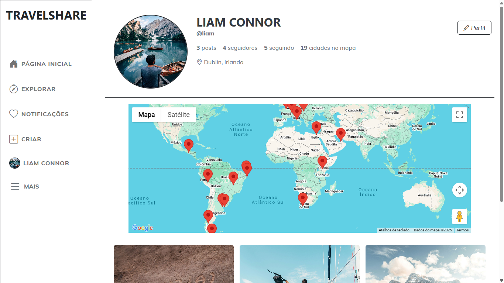

# 🌍 Travel Share
 


📽️ [Assista à demonstração do projeto](https://drive.google.com/file/d/120kbFAEOiUIzhuHOZ_bvxiniKnLNZGYw/view?usp=sharing)

TravelShare é uma rede social desenvolvida em ASP.NET Core MVC, focada no compartilhamento
de experiências de viagem. A plataforma permite que os usuários registrem e exibam os destinos
que já visitaram através de um mapa interativo, integrado com a Google Maps API.
O sistema oferece funcionalidades essenciais para interação social, como postagens, curtidas,
comentários, seguidores e notificações, além de uma aba Explorar, onde os usuários podem descobrir publicações de outras pessoas.

## Principais Funcionalidades

👥 Gerenciamento completo: Usuários, postagens, curtidas, comentários, seguidores e notificações.

🔐 Autenticação segura: Login com cookies e filtros de autorização.

📧 Recuperação de senha via e-mail (SMTP): Envio de link para redefinição com validação segura.

🔄 Alteração de senha: Validação da senha atual e critérios de segurança.

🛡️ Segurança reforçada: Proteção contra ataques XSS e CSRF.

🗂️ MongoDB Driver: Interação com banco de dados NoSQL, garantindo escalabilidade.

🔒 Criptografia de senhas: Armazenamento seguro de credenciais.

🧠 Sessão do usuário: Autenticação persistente durante a navegação.

📋 Logs de atividades: Monitoramento e diagnóstico com Serilog.

🌍 Mapa interativo com Google Maps API: Visualização dos destinos visitados.

🏙️ Autocomplete com Google Places API: Busca inteligente de cidades para adicionar viagens.

## Tecnologias Usadas

### Back-End


### Front-End


### Integrações e Serviços
- 📧 **SMTP** – Envio de e-mails para redefinição de senha
- 📜 **Serilog** – Registro de logs e monitoramento de atividades
- 🔹 Google Maps JavaScript API - Usada para renderizar o mapa interativo com os destinos visitados no perfil do usuário.
- 🔹 Google Places API (Autocomplete) - Utilizada para fornecer sugestões de cidades durante o cadastro de novas viagens, melhorando a usabilidade e reduzindo erros de digitação.
- 🔹 Google Geocoding API - Converte nomes de cidades em coordenadas geográficas (latitude/longitude) para exibição correta no ma+pa.

## Instalação


### ✅ Pré-requisitos

Antes de rodar o projeto, você precisa ter:

- [Visual Studio 2022+](https://visualstudio.microsoft.com/) com suporte a **ASP.NET Core e .NET 8**
- [.NET SDK 8.0](https://dotnet.microsoft.com/en-us/download/dotnet/8.0)
- [MongoDB](https://www.mongodb.com/try/download/community) instalado e rodando localmente
- [MongoDB Compass](https://www.mongodb.com/products/compass) (opcional, para visualização do banco)
- Conta no [Google Cloud](https://console.cloud.google.com/) para uso das APIs (Maps e Places)
- Compatível com: **Windows**, **macOS** e **Linux**

---

### 🧩 Passo a passo

#### 1️⃣ Clone o repositório

```bash
git clone https://github.com/alicemarquesdev/TravelShare.git
```

#### 2️⃣ Restaure os pacotes NuGet

```bash
dotnet restore
```

Pacotes NuGet utilizados:

- MongoDB.Driver (3.3.0)
- Newtonsoft.Json (13.0.3)
- Serilog (4.2.0)
- Serilog.AspNetCore (9.0.0)
- Serilog.Sinks.Console (6.0.0)
- Serilog.Sinks.File (6.0.0)
- SixLabors.ImageSharp

#### 3️⃣ Configure o appsettings.json
Crie ou edite o arquivo appsettings.json com suas informações de conexão, API e SMTP:

```bash
{
  "Logging": {
    "LogLevel": {
      "Default": "Information",
      "Microsoft.AspNetCore": "Warning"
    }
  },
  "Serilog": {
    "Using": [ "Serilog.Sinks.File" ],
    "MinimumLevel": "Information",
    "WriteTo": [
      {
        "Name": "File",
        "Args": {
          "Path": "logs/app.log",
          "RollingInterval": "Day",
          "RetainedFileCountLimit": 7,
          "FileSizeLimitBytes": 10485760,
          "Buffered": true
        }
      }
    ]
  },
  "MongoDB": {
    "ConnectionString": "mongodb://localhost:27017",
    "DatabaseName": "NomeDoBanco"
  },
  "GoogleAPISettings": {
    "ApiKey": "SuaAPIKey"
  },
  "EmailSettings": {
    "SmtpServer": "smtp.gmail.com", 
    "SmtpPort": 587,
    "SenderEmail": "seuemail@dominio.com",
    "SenderPassword": "suasenha"
  },
  "AllowedHosts": "*"
}
```

#### 4️⃣ Execute o projeto
No Visual Studio, clique em Iniciar (F5) ou use: 
```bash
dotnet run
```

#### 5️⃣ Acesse no navegador
O projeto estará disponível em:
```bash
http://localhost:5000
```
Ou a porta definida no launchSettings.json.

## Licença

Este projeto está licenciado sob a Licença MIT. Veja o arquivo [LICENSE.txt](LICENSE.txt) para mais detalhes.

## Contato

🔗[**LinkedIn**](https://linkedin.com/in/alicemarquesdev)  |
 📧 [**E-mail**](mailto:alicemarques.dev@hotmail.com)  |
🌐 [**Portfólio**](https://alicemarquesdev.github.io/portfolio-AM/) 


