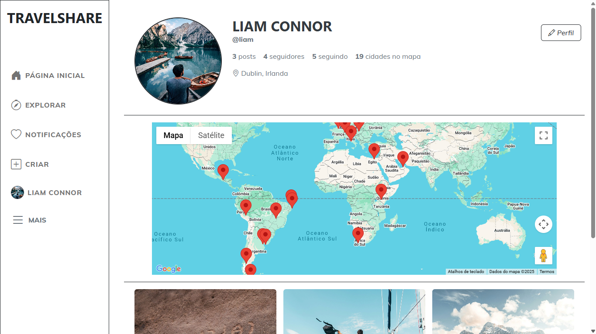

# 🌍 Travel Share
 [Veja a aplicação em ação](mailto:alicemarques.dev@hotmail.com)



TravelShare é uma rede social desenvolvida em ASP.NET Core MVC, focada no compartilhamento
de experiências de viagem. A plataforma permite que os usuários registrem e exibam os destinos
que já visitaram através de um mapa interativo, integrado com a Google Maps API.
O sistema oferece funcionalidades essenciais para interação social, como postagens, curtidas,
comentários, seguidores e notificações, além de uma aba Explorar, onde os usuários podem descobrir publicações de outras pessoas.
Com uma interface intuitiva e um sistema de controle de acesso seguro, TravelShare proporciona uma 
experiência envolvente para quem deseja compartilhar e acompanhar histórias de viagem ao redor do mundo.

## Principais Funcionalidades
- **Gerenciamento**: Permite o gerenciamento de usuário, posts, curtidas, comentários, seguidores e notificações, garantindo um fluxo dinâmico de compartilhamento de experiências de viagem.
- **Sistema de Login**: Autenticação segura baseada em cookies, garantindo acesso autorizado à plataforma.
- **Redefinição de Senha via Email (SMTP)**: Envio de email para redefinição de senha.
- **Alteração de Senha**: Permite que o usuário altere sua senha, validando a senha atual e garantindo critérios de segurança.
- **Filtros de Autorização**: Controle de acesso para garantir que apenas usuários autenticados possam interagir com postagens e visualizar informações restritas.
- **Segurança**: Proteção contra ataques como XSS e CSRF, garantindo um ambiente seguro.
- **MongoDB Driver**: Utilização do MongoDB Driver para interação com o banco de dados NoSQL MongoDB, garantindo escalabilidade e flexibilidade na manipulação de dados.
- **Proteção de Senha**: Criptografia de senhas para armazenamento seguro.
- **Sessão do Usuário**: Gerenciamento seguro da sessão do usuário, garantindo persistência da autenticação durante a navegação.
- **Logs de Atividade do Usuário**: Registro de atividades do usuário para monitoramento e diagnóstico do sistema.
- **Integração com Google Maps API**: Exibição de um mapa interativo com os locais visitados pelos usuários, utilizando as APIs do Google Maps para visualização dinâmica dos destinos.
- **Pesquisa de Cidades com Google Places API**: Autocomplete para busca de cidades, permitindo que os usuários selecionem locais de forma rápida e precisa ao adicionar novas viagens.

## Tecnologias Usadas

### **Back-End**
C# | ASP.NET Core MVC | MongoDB

### **Front-End**
HTML | CSS | Bootstrap | jQuery | JavaScript

### Integrações e Serviços
- **Google Maps API** – Autocomplete para endereço nos locais visitados e exibição de mapa interativo.
- **SMTP** – Envio de emails para redefinição de senha
- **Serilog** – Registro de logs e atividades

## Instalação

### **Pré-Requisitos**

Antes de rodar o projeto, é necessário ter as seguintes ferramentas instaladas:

- **Visual Studio 2022 ou superior** com o suporte para **ASP.NET Core e .NET 8.0**.
- **.NET SDK 8.0** (necessário para compilar o projeto).
- **SQL Server** (necessário para o banco de dados relacional).
- Compátivel com **Windows** | **macOS** | **Linux**.
- Conta no Google Cloud – Para Integração com APIs do Google


### **Passo a Passo para Executar o Projeto Localmente**

1. **Clonar o Repositório**  
   Primeiro, você precisa clonar o repositório do projeto para sua máquina local. Utilize o Git para isso:

```bash
git clone https://github.com/alicemarquesdev/TravelShare.git
```

2. **Instalar as Dependências do Projeto**

Execute o comando abaixo para restaurar pacotes NuGet

```bash
dotnet restore
```

- MongoDB.Driver(3.3.0) | Newtonsoft.Json (13.0.3) | Serilog (4.2.0) | Serilog.AspNetCore (9.0.0) | Serilog.Sinks.Console (6.0.0) |
Serilog.Sinks.File (6.0.0) | SixLabors.ImageSharp

3. **Configuração appsettings**
Verifique se você possui um arquivo appsettings.json com as configurações corretas para o banco de dados e outras variáveis.
Certifique-se de ter o SQL Server instalado e configurado. Crie um banco de dados para o projeto e configure a string de conexão no arquivo.
Configure também as credenciais SMTP.
Exemplo de configuração:

```bash
{
  "Logging": {
    "LogLevel": {
      "Default": "Information",
      "Microsoft.AspNetCore": "Warning"
    }
  },
  "Serilog": {
    "Using": [ "Serilog.Sinks.File" ],
    "MinimumLevel": "Information",
    "WriteTo": [
      {
        "Name": "File",
        "Args": {
          "Path": "logs/app.log",
          "RollingInterval": "Day",
          "RetainedFileCountLimit": 7,
          "FileSizeLimitBytes": 10485760,
          "Buffered": true
        }
      }
    ]
  },
  "MongoDB": {
    "ConnectionString": "mongodb://localhost:27017",
    "DatabaseName": "NomeDoBanco"
  },
  "GoogleAPISettings": {
    "ApiKey": "SuaAPIKey"
  },
  "EmailSettings": {
    "SmtpServer": "smtp.gmail.com", // utilizando gmail
    "SmtpPort": 587,
    "SenderEmail": "seuemail@dominio.com",
    "SenderPassword": "suasenha"
  },
  "AllowedHosts": "*"
}
```

4. **Executar o Projeto**
Clique em Run ou Iniciar sem Depuração (F5) para rodar o servidor localmente. O projeto será executado no navegador padrão.

5. **Verificação**
Após a execução, o projeto estará disponível em http://localhost:5000 (ou a porta configurada no launchSettings.json). 
Verifique se o sistema está funcionando conforme esperado.

## Licença

Este projeto está licenciado sob a Licença MIT. Veja o arquivo [LICENSE.md](LICENSE.md) para mais detalhes.

## Contato

Você pode entrar em contato comigo através do e-mail [alicemarques.dev@hotmail.com](mailto:alicemarques.dev@hotmail.com).

Link do Projeto: [GitHub - Travel Share](https://github.com/alicemarquesdev/TravelShare.git)


